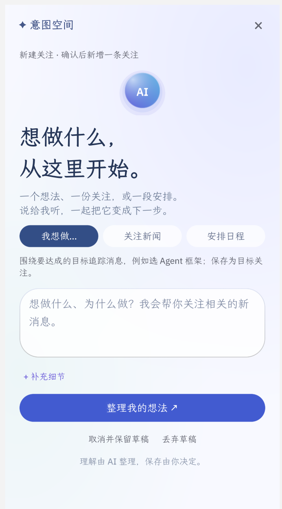
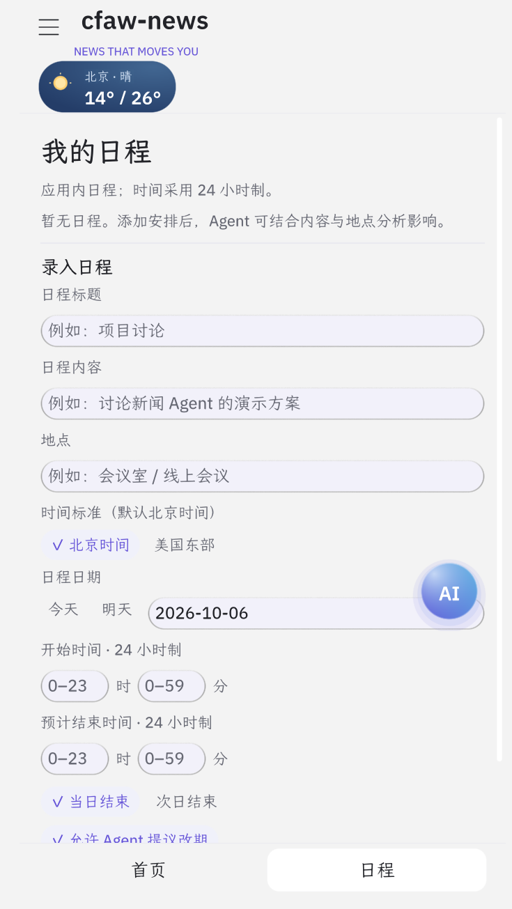
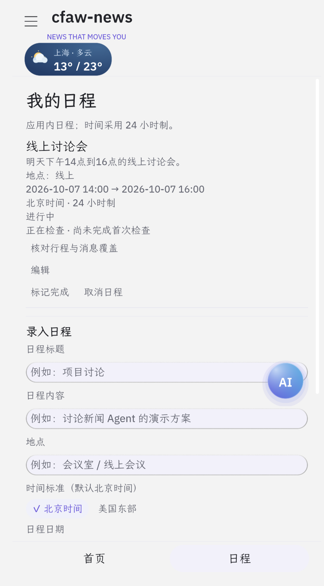
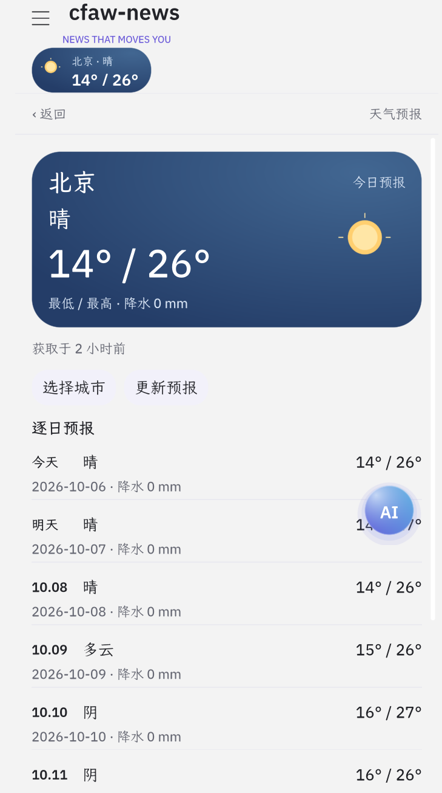
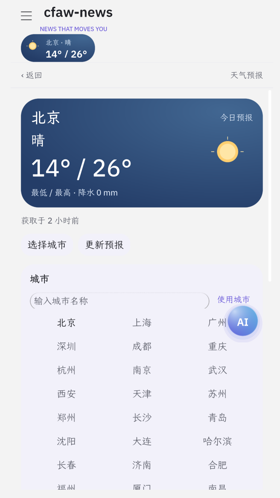
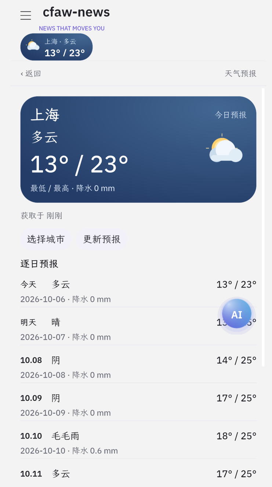
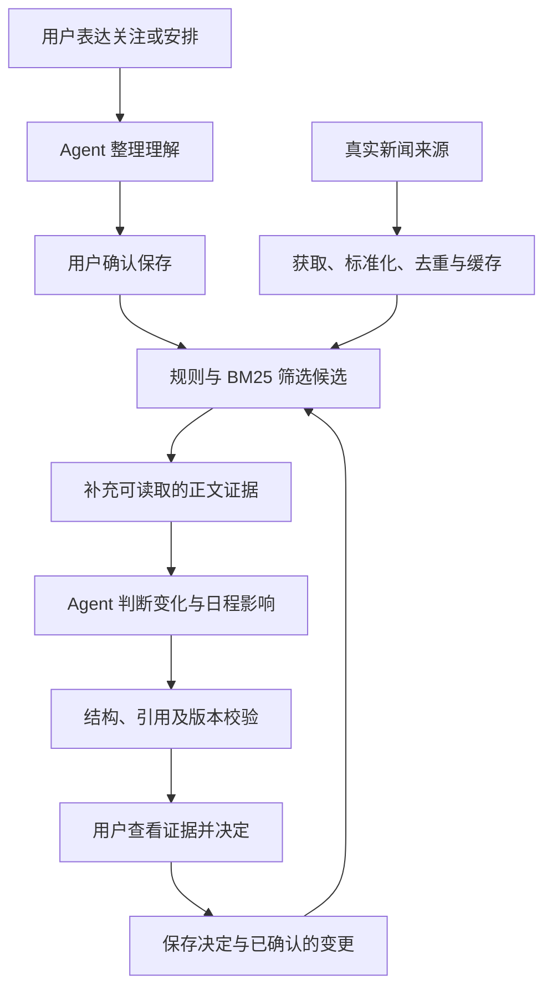

# CFAW News

**让 AI 新消息，与你的下一步有关。**

CFAW News 是一款运行于 **Rinx** 的新闻 Agent 应用，面向工作、学习与日常生活中的信息需求。用户用自然语言表达关注或安排，应用从真实来源获取新闻，筛选相关新闻，并由 Agent 判断变化与用户目标、日程的关系。用户可以阅读报道、核对证据，再决定观察、处理或忽略建议。

我们希望回答的不只是“今天发生了什么”，还有：**“这条新消息，是否改变我下一步应该做什么？”**

界面与业务采用 **OctoScript / Makepad**，助手通过 Rinx 管理的 Octos 服务运行，团队选择 **MiniMax** 作为模型提供方。

## 为什么做这个作品

AI 工具、研究和应用每天都在更新，但信息数量增加，并不意味着用户更容易找到有用的内容。

- **工作中**：想知道新的 AI 能力能否帮助整理资料、撰写内容或改善工作流程。
- **学习中**：想了解适合当前学习目标的新工具与进展，而不只是浏览技术名词。
- **生活中**：想持续关注感兴趣的领域，或判断新信息是否影响已有安排。

CFAW News 把用户目标、相关新闻、应用内日程和用户决定放在同一个流程里。它不会把“有关联”直接当成“应该行动”：证据不足时应说明未知项，没有实质变化时也可以不提出新建议。

## 核心体验

### 1. 用一句话表达关注

点击悬浮 AI 小球，进入全屏意图空间。可以持续关注一个话题，也可以围绕实际目标表达需求，例如：

> 我想了解最新 AI 进展如何帮助我的工作、学习和日常生活。

> 关注具身智能领域。

Agent 整理关注目的、范围与偏好，必要时提出关键追问。用户查看理解预览后确认保存；关注可以修改、暂停、恢复或取消。尚未确认的输入保留为草稿，不直接变成正式记录。

空白意图面板提供三个可编辑的生活场景入口：**每周两小时学习 AI、是否换电脑、家人云相册的权益与隐私变化**。点击仅填入目标示例，不调用模型、不直接保存，也不会覆盖已有草稿。请按自己的情况修改；涉及具体产品的关注，应补充产品名称。

从表达想法到确认关注：输入“我想了解最新 AI 进展如何帮助我的工作、学习和日常生活”，Agent 将其整理为关注目标、具体范围与偏好，用户核对后再保存。

| 表达想法 | 核对 Agent 的理解 |
| --- | --- |
|  |  |

本文图片均为团队提供的应用运行截图，展示拍摄时的界面状态；新闻、天气及日程时间以当时的数据为准。

### 2. 阅读真实来源的新闻

首页提供搜索、分类筛选、图片热点卡片和普通新闻列表。新闻保留来源、原文地址、发布时间与获取时间；未知日期不会被填造。

- 点击“刷新新闻”或在新闻区域上滑，主动更新启用的来源。
- 刷新过程中可以停止更新；右下角箭头返回顶部。
- “我的 → 新闻来源”可以调整来源，并查看各来源的获取状态。
- 与有效关注、日程有关的报道参与首页排序；规则匹配本身不会被当作 Agent 分析结论。

新闻来自配置中的真实来源。本地缓存支持再次阅读，获取失败时不会填充编造报道。

当前默认启用 **36氪、IT之家、少数派、MIT Research、Solidot、爱范儿、NASA 新闻发布**。原有其他来源保留在来源目录中，暂时关闭。升级时首次迁移旧来源选择，保留关注、收藏和日程；之后尊重用户在来源页的选择。已有第一批五源配置的用户可在来源页开启爱范儿与 NASA；不会自动覆盖自选配置或全部关闭的选择。

点击“关注话题”会用文章标题和原文地址创建可编辑草稿；用户调整对象与范围，整理后确认保存，才产生跨来源的话题关注。不会一键关注整个媒体；已有未完成草稿先恢复，避免被另一篇新闻覆盖。旧来源规则仍可在关注管理页删除。

Windows 宿主对单次脚本回调有时间限制；启动时分段读取收藏、关注、日程和分析记录，随后逐源恢复新闻缓存，避免已有记录使初始化中断。公开来源超时或限流会显示在“新闻来源”中，并计入已完成进度。

首页将搜索、分类、天气入口和主动刷新放在上方，下面展示图片热点与新闻列表。每条报道保留来源和发布时间，并提供关注话题、收藏与查看入口；悬浮 AI 小球可随时进入意图空间。

<p align="center">
  
</p>

### 3. 看正文、配图与原文

受支持的网页可以提取正文段落、标题、列表、引用、部分图片和图注。阅读页采用两端对齐、宽松行距和段间留白，正文宽度限制在适合阅读的范围内。

阅读页分别展示标题、新闻摘要和正文。MIT、少数派、爱范儿与 NASA 直接显示来源摘要；36氪、IT之家与 Solidot 的 RSS 描述是正文，单独保存，不冒充摘要。正文优先读取 RSS 提供的文章内容，少数派读取公开文章的 SSR 正文段落（嵌入视频、配图可在应用内原文页查看）。Solidot 提供的是其自身短报道，不是所引用的外部报道全文。

没有来源摘要时，点击 **“Agent 摘要提取”** 才使用 Rinx 已配置的助手生成摘要。长文章按 Unicode 字符分段，全部分段处理后汇总；正文未读取成功或被截断时不生成全文摘要。支持取消和失败重试，切换新闻会取消当前摘要任务；生成结果在当前会话中保留。此功能与追踪共用应用 Agent 的调用边界，模型与密钥仍由宿主管理。

配图优先使用网页提供的阅读尺寸和懒加载地址，避免下载超大的印刷原图；保留每图 2 MB、合计 6 MB 的限制。单张失败会显示原因并提供“重试配图”，也可在应用内原文页查看。

“打开图文原文”使用应用内 `WebReader` 打开来源网页，不再调用 `LinkLabel/open_url`。返回按钮先关闭网页并回到新闻详情，再次返回新闻列表。原文地址仍可复制；结构化图文阅读仍保留。原站网页能否呈现取决于宿主的内嵌网页实现及网站访问条件，结构化阅读不执行原站脚本。

当来源限制正文读取时，应用保留可用摘要与原文入口，并说明无法读取的原因。没有摘要时也不会生成虚构摘要。

遇到 AWS / Cloudflare 人机验证响应时，新闻详情会自动进入应用内原文页，用户可在页面中完成验证后继续阅读。Windows 开发宿主通过 `native/windows-webreader` 提供 WebView2 实现，并在独立的 WebReader 会话目录中保留网站验证 Cookie；这不会让普通 HTTP 抓取器自动得到全文，也不会将未抓取的正文冒充 Agent 分析证据。

Windows 请使用支持 WebReader 的 Rinx 宿主。`scripts/patch_webreader_host.py` 可将后端接到当前锁定的 Makepad；`scripts/build_webreader_host.ps1` 接收 `-HostRoot`、`-CargoHome`、`-Python` 并构建 `rinx-webreader.exe`。退出旧宿主后，可使用 `scripts/start_webreader_host.ps1` 启动新宿主，再导入更新后的 bundle。运行需要 WebView2 Runtime，当前验证机器已安装；网页仍可能要求用户验证、登录或订阅。

### 4. 查看变化分析与建议

底部导航包含“首页、关注、日程、我的”。“关注”页通过“动态 / 建议”切换相关新闻与分析结果，提供新增关注、继续草稿和管理入口；待处理数量显示在关注入口和建议页签。“我的”页集中提供收藏、新闻来源与连接诊断。天气从首页顶部进入。

分析围绕发生了什么、与哪个目标有关、依据是什么以及还需要核实什么展开。可用正文段落作为引用时，用户可以核对具体段落；只有标题或摘要时，不应声称已阅读完整正文。

分析页聚焦当前需要关注的变化与建议。应用记住已有分析与用户决定，减少重复提醒，让用户把注意力留给真正需要重新考虑的消息。

结果页显示本次目标与偏好、决策影响、可用的原文引用、待核实项和下一步。更新或撤回时，按本次记录的比较轮次与同一问题展示“上次判断 / 这次判断 / 改变判断的新事实”；旧轮次被有界缓存淘汰时明确说明无法完整对照。撤回默认可见，“查看本轮全部判断与决定”还可查看无变化、已处理或已忽略的当前有效判断。

点击“把核实安排到日程”，只把下一步填入日程草稿。补充日期和起止时间、整理并确认后才保存；已有草稿会保留，不被新建议覆盖。三个案例的演示准备与实际能力边界见 [生活场景演示指南](docs/demo-life-scenarios.md)。

### 5. 把判断与日程联系起来

日程可以通过自然语言预览后确认创建，也可以在日程页表单中管理。支持标题、内容、地点、起止时间与时区，保存前检查冲突。

新建日程默认允许 Agent 提议改期。**提议不等于执行：日程变更仍需用户确认。** 保存前重新检查日程版本、冲突与证据，避免旧结果覆盖新安排。

日程支持编辑、完成与取消；取消后从主列表隐藏，重启不会恢复。当前日程是应用内记录，不是系统日历。

例如输入“明天下午 14 点到 16 点我有一场线上讨论会”，Agent 整理出标题、日期、起止时间、时区与地点，等待用户确认。也可以直接填写日程表单。保存后的日程提供编辑、标记完成和取消入口。

| 自然语言理解预览 | 手动录入表单 | 确认保存后的日程 |
| --- | --- | --- |
|  |  |  |

### 6. 收藏与天气

“我的收藏”保存新闻快照，以简洁的纵向列表呈现。支持分类和关键词组合筛选，便于积累资料、再次阅读；新闻缓存更新不会删除收藏。

收藏页直接展示已收藏的新闻列表，保留来源、配图和查看入口，便于集中整理感兴趣的报道。

<p align="center">
  
</p>

天气组件提供选城、今日温度范围和 7 日预报。天气使用城市参考坐标，不读取设备位置；当前天气尚未参与 Agent 的新闻影响分析。

点击天气入口查看逐日预报，通过“选择城市”输入或选择城市。下面展示从北京切换至上海后的预报与顶部天气组件同步更新。

| 查看天气预报 | 选择城市 | 切换后的上海预报 |
| --- | --- | --- |
|  |  |  |

## 一次完整的体验流程

1. 打开应用，点击 AI 小球，输入上面的 AI 工作、学习与生活关注示例。
2. 检查 Agent 对需求的理解，补充必要信息，然后确认保存。
3. 返回首页，点击“刷新新闻”，按分类或关键词查看真实报道。
4. 打开一条相关新闻，阅读摘要、可用正文与配图，必要时打开原文。
5. 从底部进入“关注”，检查关注更新，并在“建议”页签查看当前分析及证据。
6. 对建议作出决定；如涉及日程变更，检查提案后再确认。

分析是否产生建议，取决于实际获取的新闻与用户目标。没有候选、没有实质变化、证据不足和分析失败是不同状态，不保证每次检查都会产生行动建议。

初次体验可借助明确标注的示例关注与行程了解关联流程，也可以按自己的需求重新设置。示例上下文不代表真实用户计划，分析仍以实际获取的新闻为依据。

## 技术实现

### 一个 Agent，配合检索与确定性校验

应用使用一个 Agent 完成意图整理和影响判断。新闻获取、检索、持久化、引用校验与版本检查由应用代码承担；模型输出必须通过校验后才能用于业务状态。



| 层次                   | 主要职责                       |
| -------------------- | -------------------------- |
| OctoScript / Makepad | 页面、列表、意图空间、悬浮球、图文阅读与交互     |
| Rinx / Octos         | 宿主能力、助手配置、模型凭据、会话及任务生命周期   |
| 数据层                  | 来源请求、新闻标准化、缓存、BM25 召回与本地记录 |
| Agent 层              | 意图整理、变化判断、分析结果解析与证据校验      |
| 应用集成层                | 导航、刷新、状态协调、过期结果拒绝与用户确认     |

具体实现包括：

- **候选召回**：来源/分类规则与 BM25，支持英文词及中文二元词；当前没有向量索引。
- **有界分析**：每轮最多检查 2 个目标、8 条候选，正文证据最多补充 2 篇；没有候选时不调用模型。
- **严格引用**：新闻标识和段落标识必须来自本轮证据，引用文字必须对应实际段落；无正文时不能构造段落引用。
- **有限修正**：分析结果结构或引用不合格时，最多自动修正一次；仍不合格则记录失败原因。
- **状态一致性**：输入、目标、日程或证据版本改变后，迟到结果不能覆盖当前状态。
- **用户控制**：关注和日程经过预览确认，改期建议经过再次确认；新闻内文本不能授权操作。

### 新闻来源与更新策略

当前来源目录包含 **18 个可选来源，13 个默认启用**，覆盖科技、AI、国际、财经、中文资讯和民航出行。

| 范围     | 来源示例                                                   |
| ------ | ------------------------------------------------------ |
| 科技与产品  | Hacker News、TechMeme、The Verge、Ars Technica、TechCrunch |
| AI 与研究 | VentureBeat AI、MIT Research、arXiv AI / ML              |
| 国际与财经  | BBC、The Guardian、CNBC；Reuters / AP 经 Google News 聚合    |
| 中文与出行  | 金十资讯、工信部、商务部的 Google News 聚合；国航民航资讯                    |

来源清单以 [sources.json](src/data/ingestion/sources.json) 为准，包含原创媒体、研究机构及聚合入口。中文报道同样参与浏览与检索。

启动先恢复真实缓存，随后刷新缺失或至少 5 分钟未更新的启用来源；手动刷新更新全部启用来源。最多并发 3 个请求、每源保留 20 条、合并新闻流最多 240 条。这些是资源上限，不代表每次一定获取到相同数量。来源可用性、发布频率和网络环境决定实际结果。

### 数据与模型配置

关注、草稿、收藏、日程及用户决定保存在宿主提供的应用存储中。坏文件不会直接被默认数据覆盖，可用时尝试有效备份。收藏是独立快照，不依赖当前新闻流是否还保留该报道。

模型密钥由 Rinx 管理，应用代码和 bundle 不持有密钥。执行 AI 分析时，相关目标、日程信息与候选证据会通过宿主交给所配置的模型；因此本地保存不意味着模型推理完全离线。

## 快速开始

### 已有 Rinx：导入应用

1. 启动与本项目兼容的 Rinx，完成宿主要求的登录与助手配置。
2. 打开 **Mini apps → Import an app**。
3. 在 **OctoSense bundle folder** 中填写本仓库 `bundle/` 的绝对路径。
4. 执行 **Review bundle → Run**，按宿主界面完成权限审查。
5. 进入新闻应用，刷新新闻并按上面的流程体验。

`build/cfaw-news.zip` 是打包脚本生成的本地导入交付包，解压后同样得到 `bundle/`。`build/` 不纳入 Git；源码仓库包含 `bundle/` 与生成脚本。更新代码后需重新打包、退出旧应用并重新导入，不能只替换运行中的文件。

体验完整的长按拖拽、系统浏览器阅读与正文排版，需要兼容的 Rinx 宿主。团队使用 Rinx-main；开发脚本的固定依赖见 [依赖锁](dev-dependencies.lock.json)，宿主兼容与环境准备见 [Windows 开发指南](docs/windows-development.md)。

### MiniMax 助手配置

本项目已有联调配置如下；使用前需确认自己的账号可以访问对应模型。

| Rinx 配置项 | 填写内容                           |
| -------- | ------------------------------ |
| Provider | `minimax`                      |
| Model    | `MiniMax-M3`                   |
| Base URL | `https://api.minimax.cn/v1`    |
| API key  | 自己的 MiniMax API key，在 Rinx 中填写 |

选择 **Use this device**，由 Rinx 启动配套 Octos。这里的本地设备指助手运行时在本机，模型仍可通过云端 API 推理。应用不需要自行填写 Octos 服务地址或另建模型客户端。

配置后，在应用的 **我的 → 新闻来源 → 连接诊断 → 测试连接** 检查宿主与模型是否真正返回回复。新闻刷新、阅读、收藏和手动日程管理不依赖模型成功连接。

详细配置、密钥保存行为与故障处理见 [开发与运行说明](docs/development.md)。密钥仅在宿主配置中填写，不写入源码、截图或提交记录。

### Windows：从源码准备开发环境

需要 Git、Python 3、Rust，以及 Visual Studio C++ Build Tools、Windows SDK 和 CMake/Ninja。Python 工具脚本无需额外的第三方 Python 运行依赖；锁定宿主使用 Rust `1.98.0`。

在本项目根目录执行：

```powershell
rustup toolchain install 1.98.0 --profile minimal
python scripts/prepare_dev_dependencies.py
powershell -ExecutionPolicy Bypass -File scripts/build_windows_tools.ps1 -Mode All
powershell -ExecutionPolicy Bypass -File scripts/run_windows.ps1 -Mode Rinx
```

依赖默认位于 `.dev/vendor/`。完整的环境准备、宿主构建与兼容性说明见 [Windows 开发指南](docs/windows-development.md)。

只预览界面时可以使用：

```powershell
powershell -ExecutionPolicy Bypass -File scripts/run_windows.ps1 -Mode Preview
```

Preview 使用参考 card-host，不提供 Rinx 的 Octos 助手服务；它适合检查界面和数据模块，不能替代真实 Agent 验收。

Windows Preview 也需要手势宿主补丁，避免悬浮球的全屏尺寸监听层拦截底层按钮。启动脚本校验 card-host 与 widgets 的补丁产物；旧 Preview 请先运行 `scripts/build_windows_tools.ps1 -Mode Preview`，使用共享依赖时为构建和启动同时指定 `-DevRoot`。Preview 的补丁记录独立于 Rinx。

### Linux：构建与运行

在具备图形会话和所需原生依赖的 Linux 环境中执行：

```bash
python3 scripts/run_linux.py --build
# 后续启动
python3 scripts/run_linux.py
# 仅构建参考预览宿主并打开界面
python3 scripts/run_linux.py --mode Preview --build
```

原生依赖安装方式与运行说明见 [开发指南](docs/development.md)。Windows 与 Linux 的宿主构建、字体和资源路径分别核验，不能直接复用另一平台的二进制。

## 开发、打包与验证

### 仓库结构

```text
src/
  frontend/              页面、组件、样式与交互
  agent/                 助手运行、提示词、分析结果与校验
  data/                  数据获取、检索和持久化
  app/                   配置、启动、导航与业务接线
  contracts/             数据契约与共享校验
bundle/                  宿主加载的 manifest 与生成入口
scripts/                 依赖准备、构建、组装、打包与验证
tests/                  单元测试、固定输入与原生业务场景
docs/                   使用、设计、验收与团队交接文档
reports/                分阶段验证与问题调查记录
dev-dependencies.lock.json
LICENSE / NOTICE
```

业务源码维护在 `src/`。`scripts/assemble.py` 按固定顺序生成 `bundle/main.splash`；新增执行模块需要更新脚本中的 `ORDER`，不要手工维护两套入口。

### 打包

准备并构建配套 Hub 工具后执行：

```powershell
python scripts/package.py
python scripts/assemble.py --check
```

脚本组装源码、核对网络域名，通过 Hub 的 `stamp` 刷新完整性摘要，输出 `build/cfaw-news.zip`。如使用其他位置的已构建 Hub，可设置 `OCTO_HUB` 为其可执行文件路径。

不要手工修改 manifest 中的摘要。仅组装源码后直接导入，可能出现 `bundle digest does not match the manifest`；应重新执行完整打包流程。此脚本用于未签名开发包，不是正式发布或签名流程。

### 推荐验证

```powershell
# Python 工具测试
python -m unittest discover -s tests/unit -p "test_*.py"

# 已构建原生参考宿主后，运行新闻数据检查
python scripts/test_runtime.py --suites news

# 分析结果、引用及恢复检查
python scripts/test_tracking_repair.py
```

原生场景测试需要对应宿主与资源；完整命令和其他场景见 [验收记录](docs/acceptance.md) 及 [Windows 开发指南](docs/windows-development.md)。测试使用隔离数据和明确标记的固定输入，不在普通应用启动时注入测试新闻。

体验或参与开发时，可以按以下场景检查完整流程：

| 场景      | 预期表现                           |
| ------- | ------------------------------ |
| 表达关注并确认 | 理解可检查，确认后出现在关注管理中，输入变化不会被旧回复覆盖 |
| 刷新真实新闻  | 可主动更新，显示真实来源信息，无演示新闻替补         |
| 收藏带图新闻  | 收藏页只有条状列表，可分类、搜索、查看和取消收藏       |
| 阅读支持的网页 | 正文段落与可用图片可显示，原文入口可打开           |
| 遇到网站验证  | 进入应用内原文页完成验证，不把验证页作为正文          |
| 检查关注与日程 | 区分有效结果、无变化、证据不足和失败，并能查看具体原因    |
| 确认日程提案  | 只有用户确认后才保存，过期版本和冲突会被拒绝         |
| 取消与重启   | 取消的关注、日程保持隐藏，真实收藏和有效记录保留       |
| 悬浮小球    | 配套宿主中可长按拖动，位置持久化，普通点击进入意图空间    |

## 当前边界与常见问题

- **新闻并非全网实时覆盖**：当前使用配置中的公开来源，存在缓存、数量上限和来源不可用的情况。
- **正文可用性依网站而异**：订阅、登录、脚本渲染或人机验证可能阻止应用直接读取；此时通过原文入口阅读。浏览器验证状态不会自动同步到应用。
- **跟踪在前台运行**：关闭应用后的持续监测、系统通知和跨设备同步尚未实现。
- **日程属于应用内部**：未写入操作系统日历，不自动执行改期。
- **天气独立展示**：未接入设备定位，也未加入 Agent 联合分析；节假日与汇率没有进入当前页面。
- **模型能力依赖配置**：接口可用性与结果质量由所选提供方、模型及证据决定；校验失败的输出不能作为成功结果保存。
- **发布与导入不同**：当前已提供本地导入包，正式 App Hub 上架仍需按发布流程准备资料并单独验证。

遇到“助手不可用”时，先检查 Rinx 助手配置并运行连接诊断；遇到正文错误时，记录来源、原文链接和具体错误。当前分析失败会保存更具体的原因，便于区分结构、新闻引用、段落引用或版本冲突。

## 延伸阅读与贡献

| 文档                                  | 内容              |
| ----------------------------------- | --------------- |
| [运行与开发](docs/development.md)        | 导入、模型配置、平台运行及调试 |
| [数据来源](docs/data-sources.md)        | 来源、缓存、请求与数据边界   |
| [图文阅读](docs/reader-improvements.md) | 正文提取、配图、排版与原文阅读 |
| [验收记录](docs/acceptance.md)          | 分阶段测试结果与待验收事项   |
| [贡献约定](AGENTS.md)                   | 分层职责、数据保护与验证要求  |

欢迎围绕来源兼容、阅读体验、检索质量、状态恢复与真实业务案例提出 Issue 或改进。提交问题时附复现步骤、宿主版本及相关错误；不要附带模型密钥或私人账户、日程数据。

## 许可与致谢

项目采用 [Apache License 2.0](LICENSE)，保留 [NOTICE](NOTICE) 中的上游署名。作品基于 OctoSense 的新闻应用进行适配与扩展，使用 Rinx、Octos、OctoScript 与 Makepad 生态能力；来源目录参考了 World Monitor，天气使用 Open-Meteo。第三方代码、资源及数据继续遵循各自许可。

新闻正文与图片保留原始发布者归属，应用保留来源与原文链接；本项目的代码许可证不授予第三方新闻内容的版权。
