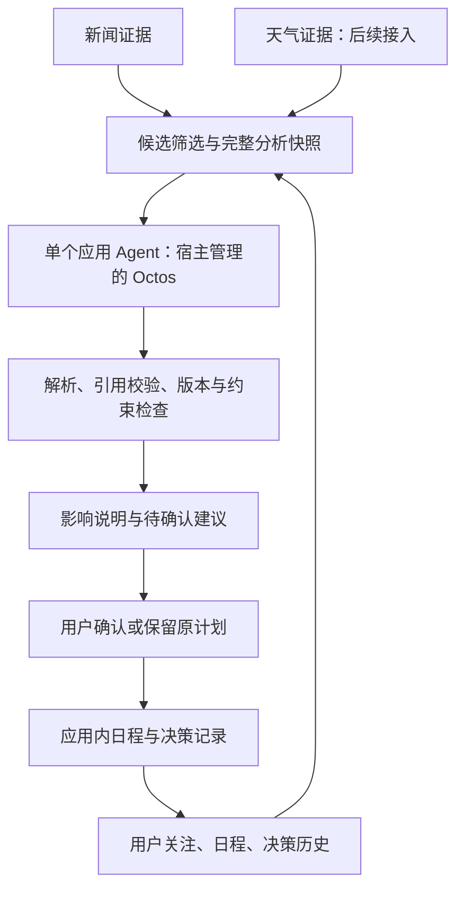

> 原始计划存档：保留阶段设计和约束；当前待办见 [实施计划](../agent-integration-plan.md)。

# CFAW News：Agent 接入与天气日程扩展实施计划

原始整理日期：2026-10-02（Asia/Shanghai）；接入核对更新：2026-10-03。原始计划代码基线：`9af7621`；当前接入核对基线：`641910a`。

本文保留原始分阶段计划，供前端、Agent 和数据同学共同交接。当前能力以代码和 [README](../../README.md) 的 Agent 接入核对及人工验收清单为准。`641910a` 已包含单条分析、验证器、建议历史、批量任务、结果页和应用内日程确认；详情页依赖、决定上下文缺失和重复建议抑制已有对应实现及回归场景。本轮复跑 91 项 Agent 固定场景和 4 项 Python 组装检查通过，源码组装一致；宿主/模型回复使用固定替代输入，真实 Rinx 业务闭环仍待验收。旧基线的 31 项结果仅为历史记录。下文对原始基线的描述不能作为当前能力结论；尚未落实的字段、约束与天气流程仍为计划。详细业务契约需随实现同步修改生产方、消费方与 fixtures。

**实施方向是：一个应用 Agent，先完成新闻影响分析，再形成建议与决策历史，随后接入应用内日程，最后加入天气联合判断。** 日程第一版就保留地点、活动类型和允许调整的范围。产品始终围绕一个问题：这条新信息是否改变用户下一步应该做什么？

**原始计划基线已具备的基础。** 下表记录 `9af7621` 时的情况；当前首页的“与你有关”仍来自用户规则，不能当作 Agent 判断。

| 范围 | 当前状态 | 接入 Agent 时的意义 |
| --- | --- | --- |
| 新闻来源 | 17 个可选、12 个默认启用，支持 RSS、Atom 与 HN JSON | 可以复用现有真实数据，不必重建抓取系统 |
| 规范化与缓存 | 保留来源、链接和时间；同链接合并引用；独立来源错误与缓存 | 可以构造可追溯证据；重复收录不等于独立印证 |
| 追踪与收藏 | 来源、主题、关键词规则；收藏快照；版本化本地记录与恢复 | 可以提供明确的用户兴趣和已有状态 |
| 新消息与已读 | 首次检查建立基线，后续新相关条目标记未读 | `seen_ids` 仅表示是否见过，不能识别同链接内容更新，也不表示已分析 |
| Octos | 来源页保留手动 Test Octos；当前运行代码只发送连接测试文本 | 需要实现正式业务运行器、输入序列化和结果校验 |
| 日程 | 页面只有未接入的空状态 | 需要先实现真实用户日程与确认流程 |
| 分析契约、提示词和 fixtures | 已有设计文档和固定样例 | 不代表运行时序列化器、验证器或业务 Agent 已实现 |
| 天气、语义召回、后台跟踪 | 尚未接入 | 后续能力分别验收，不随新增文件自动获得 |

相关实现入口：[新闻契约](../../src/contracts/news.md)、[新闻刷新](../../src/data/ingestion/feeds.splash)、[用户记录](../../src/data/storage/records.splash)、[规则匹配](../../src/data/retrieval/interests.splash)、[详情页](../../src/frontend/pages/detail.splash)。

此前对话已将代码分为三批本地提交：

| 提交 | 内容 |
| --- | --- |
| `d5b486b` | 真实新闻源、持久化追踪记录和固定数据测试 |
| `13b095c` | 真实新闻界面、分层源码组装和打包 |
| `9af7621` | Windows 宿主启动、资源准备工具和文档 |

此前对话中复跑的 43 项原生数据检查、4 项组装测试、源码一致性与 ZIP 内容检查通过。README 另记录了参考 card-host 的真实新闻与 UI 检查；这些结果不代表实际 Rinx、Octos 业务分析或 Shell 安装路径通过验收。App Hub 检查因缺少 `listing.json` 拒绝上架，当前包仍用于本地开发。本次文档整理没有新增运行验收。

**应用、数据与 Agent 的责任。** 数据层返回候选证据，Agent 判断影响，应用处理用户确认并调用存储层更新领域记录。继续由宿主管理模型配置、凭据、Octos 生命周期和工具审批。



完整调用路径为 `Makepad UI → app → agent/runtime → Rinx octos.* → 宿主管理的 Octos → 结果核验 → app → UI / storage`。新闻和天气通过明确的快照提供给同一个 Agent，不按来源、天气或日程分别创建运行时 Agent。

源码维护在 `src/`，由 [assemble.py](../../scripts/assemble.py) 按固定顺序组装为 `bundle/main.splash`。新增执行文件须加入 `ORDER`，验证作用域和初始化顺序；Markdown 提示词不会自动执行，需要明确的组装或模板加载方式。不要手工维护第二份 bundle 业务实现。

**原始分阶段交付。** 下表保留原计划的开发顺序与完成条件，不能将阶段 1–4 已有代码再当成待开发任务，也不能将固定场景通过当成真实宿主验收。当前已接通日程建议与确认；阶段 2 的动作为空约束属于当时的交付范围，当前阶段 4 的动作仍必须由用户确认。

| 阶段 | 主要交付 | 完成条件 |
| --- | --- | --- |
| 1：契约与宿主基础 | 新闻到分析输入的映射；固定 Rinx 调用、取消和时间接口验证；修正文档与样例问题 | 真实新闻可构成合法快照；超时、取消、旧回调有明确结果；支持范围经过实际运行检查 |
| 2：单条新闻影响分析 | 详情页“分析影响”；上下文、业务运行器、JSON 解析和引用校验 | 能展示依据、解释和不确定性；支持无需调整与证据不足；此阶段所有 `proposed_action` 必须为 `null` |
| 3：本次变化与历史 | 候选排序、证据版本、分析记录和用户决策；“分析本次变化” | 重复新闻不重复提醒；同链接更新可复核；已拒绝建议只有证据或约束发生实质变化才重新考虑 |
| 4：应用内日程闭环 | 用户日程录入、编辑、冲突检查；新增和改期建议的确认 | 只有用户确认才能写入；确认时重新校验版本和冲突；重复确认和写入失败可恢复、可诊断 |
| 5：天气联合分析 | 天气接入与结构化契约；地点和时段匹配；活动风险规则 | 仅影响相关活动；缺失、过期和预报范围外的数据不产生确定改期；预报变化可更新或撤回待确认建议 |

原始阶段 1 提出的加载说明与改期场景问题已有更新：[宿主与运行说明](../development.md) 已说明实际组装流程；[改期 fixture](../../tests/fixtures/analysis-reschedule.json) 已改成 9:00–11:00 发布会与研究安排重叠、建议移到 14:00–16:00。不过该 fixture 的 `proposed_action` 尚缺验证器要求的 `schedule_id/schedule_version`，输入日程也未声明 `allow_reschedule: true`，与 `expected.valid: true` 不一致；当前 Agent 测试入口未加载此 JSON fixture，91 项通过不能代表该输出通过校验。

**新闻到分析输入的映射。** 复用现有 [分析契约](../../src/contracts/analysis.md)，先对齐字段语义，不让模型承担数据转换。

| 当前记录 | 分析输入 | 实施要求 |
| --- | --- | --- |
| `interest_id / kind / value` | `interest_id / description` | 保留 ID；由代码把用户明确选择转为准确描述，标明描述来自规则投影；同步更新当前要求“用户手写描述”的契约 |
| `news_id` | `evidence_id` | 保留稳定条目标识，同时记录该次证据内容版本；不采用模型生成的 ID |
| `title / summary` | `text / content_kind` | 输入实际可用的标题与摘要；不把摘要声明为全文；无摘要的 HN 条目说明只有提交标题和链接 |
| `source_url / references` | 来源 URL 与来源引用 | 保留证据追溯关系，不把重复收录当成独立印证 |
| Unix 秒或 `null` | RFC 3339 或 `null` | 在序列化边界转换；缺日期保持未知；HN 的提交时间仍明确区别于文章发布时间 |
| 相关用户记录与版本 | `context_version / schedules / previous_decisions` | 使用请求开始时的完整快照；相关关注、证据或日程改变后，旧结果不能覆盖新状态 |

快照只包含本次需要的记录，并保存所引用的历史证据。输入超限时按确定策略减少候选数量；不得直接截断 JSON。对证据摘录做缩短时须标明实际可用范围，不能把缩短后的内容当作完整摘要或全文。没有可用证据时明确返回证据不足。

时间解析、RFC 3339 转换、IANA 时区支持、UTF-8 字节计数，以及需要时的内容指纹方法，均要核对固定宿主的实际能力。暂不能支持的时区和能力应给出明确限制，不由模型猜测转换。

**正式运行器的接法。** [connectivity.splash](../../src/agent/runtime/connectivity.splash) 是现有参考，但业务运行器需要统一任务协调和完整校验。

```text
用户操作 → 校验并保存输入快照 → 分配 request_id → 标记 running
  → octos.session.open({})
  → octos.turn.start({text: 提示词与完整 JSON 快照})
  → 解析 data.text → 校验结构、引用、证据和约束
  → 检查 request_id 与 context_version 是否仍有效
  → 成功发布结果，或返回明确错误
```

固定宿主的 `turn.start` 只接收 `text`，最终输入非空且不超过 32768 UTF-8 字节。分析契约字段不是额外宿主参数；返回的 `data.text` 也不是宿主已校验的业务 JSON。权限存在不证明实际模型服务可用。

- 连接测试和业务分析共用请求协调器，同一应用上下文只允许一个活动模型请求。
- 状态沿用 `idle / running / succeeded / failed / cancelled`；每次请求最多产生一个终态。
- 取消或超时先让旧请求失效，再按实际执行状态请求 `octos.turn.interrupt`；忽略迟到和重复完成。中断未确认时不能宣称宿主已空闲。
- 解析器接受一个完整 JSON 对象，并检查 outcome、必需字段、类型、已知引用、日程版本及动作时间；阶段 2 拒绝非空可执行动作。
- 结构通过不能证明内容正确，仍需检查说明是否得到实际证据支持、是否尊重摘要和未知日期的限制。
- `no_change` 与 `insufficient_evidence` 是业务结果；服务不可用、超时、非法 JSON 和旧上下文是失败，不能伪装成“无需调整”。
- 相关记录改变后，应用拒绝旧结果；单纯滚动、打开详情或标记已读不必让分析上下文失效。

请求 ID、建议 ID、上下文版本及提示词版本由应用管理；宿主 `turn_id` 作为返回元数据保存。模型回显的关联字段不能成为可信来源。模型不直接获取写日程权限，文章或天气响应中的指令不能授权工具调用。

**变化识别、决策历史与 UI。** 第一版批量入口是“分析本次变化”。它使用 [controller.splash](../../src/app/controller.splash) 刷新完成后构建的最终列表，不在每个来源回调里启动模型。先通过来源、主题、关键词和日程标签进行词法候选筛选与确定排序；没有实现语义索引前不称为混合检索。

分析状态与阅读状态分别记录。阅读新闻不会自动视为已分析；用户稍后仍可主动分析。内容版本与“上次成功分析的输入版本”进行比较，只更新抓取时间不算新证据。同 URL 内容变化可以触发复核，但不自动证明有值得提醒的新事实。

建议由应用分配稳定 ID，保存 `pending / accepted / dismissed / withdrawn / superseded` 和决定时间。阶段 3 须完善现有 [变化检测约定](../../src/agent/results/change-detection.md)：当前示意键不足以表达内容更新与动作时间变化，不能只靠加入新的证据 ID 决定重新提醒。

- 同条证据、重复覆盖和模型措辞变化不重复创建可见建议。
- 已拒绝建议只有影响事实、行动理由或用户约束有实质变化时才重新考虑；日程版本变化先使旧建议失效，再判断是否有新的提醒理由。
- 新证据改变待确认建议时，保留旧记录并标记 `superseded`；不再支持时标记 `withdrawn`。
- 已接受安排保留历史，后续发展可以形成新建议，但不能静默撤销用户已确认的变更。
- 存储有版本、容量和保留策略，保留解释决定所需的证据与短摘录；不默认保存全部原文、完整提示词或私人日程日志。

首页继续保持紧凑新闻流，只显示一行具体的 Agent 关联提示及待处理入口。详情区分来源事实、Agent 解释、证据引用和建议动作。分析期间、失败、证据不足、旧结果与取消均有对应状态。AI 不可用时，新闻浏览、搜索、收藏和追踪继续正常使用。部分来源失败应说明分析范围，不能据此保证“没有任何影响”。

**日程的最小模型。** 第一版先让用户手动创建真实安排，随后开放 Agent 提议 `create` 和 `reschedule`。以下字段为待实现设计，不是当前持久化格式。

| 字段 | 意义 |
| --- | --- |
| `schedule_id / version` | 稳定标识与修改版本，防止旧建议覆盖新编辑 |
| 标题、起止时间、时区 | 展示、时间匹配与冲突检查；内部时间单位和转换边界写入契约 |
| `interest_ids` 或用户标签 | 将研究、工作和其他活动关联到关注主题 |
| `activity_kind` | 区分研究、会议、出行、户外等活动；具体枚举随已支持场景确定 |
| `location` | 可选地点名称、用户确认后的坐标与当地时区；未知地点不推断 |
| `environment` | 室内、户外、混合或未知 |
| `flexibility` | 是否可移动、允许的最早开始与最晚结束；未设置时不假定可调整 |

证据支持“为什么调整”，用户约束与已有日程支持“能调整到哪里”。可行时间由代码计算与校验，Agent 在可行范围内解释和推荐；不能把新闻发布时间直接当成活动时间，也不能只凭日程名称推断活动地点或户外属性。

确认界面展示原安排、新安排、调整理由、证据和不确定性，提供“确认”和“保留原计划”。确认时重新读取日程版本、相关证据状态与全部必要冲突记录；未知冲突不能显示成“无冲突”。约束或证据发生实质变化时重新生成建议，不能沿用旧确认。

应用集成层处理确认，存储层拥有写入。设计重复确认标识、写入失败恢复与重启后的决策核对，避免部分保存导致重复执行或假成功。当前宿主存储没有已验证的 rename/fsync 原子事务能力，不能直接把多个 JSON 写入视为原子提交。系统日历、外部通知和跨设备同步以后分别接入。

**天气扩展采用结构化证据。** 增加天气数据入口，不增加一个天气推理 Agent。天气提供方尚未选择；[Open-Meteo 官方文档](https://open-meteo.com/en/docs)可作为此前对话核对过的候选参考，不能把它写成已采用的依赖。

| 天气记录内容 | 要求 |
| --- | --- |
| 提供方、来源地址和地点 | 可以追溯到实际数据来源；区分用户请求地点与返回网格地点 |
| `retrieved_at`、可选的预报发布时间 | 抓取时间与发布时间分开；提供方未返回发布时间就保持未知，接口耗时不是发布时间 |
| 预报适用时段、时区与数据版本 | 区分预报何时获取和对哪个未来时段有效 |
| 数值、单位、指标类型 | 温度、降水概率、降水量、风速等按已选提供方语义规范化，缺值不当作零 |
| 实际覆盖范围与新鲜度 | 明确能支持哪些日程；超出范围或缓存过期时展示限制 |

天气阶段通过明确的分析契约新版本区分新闻与天气，保留原有新闻 fixtures 的兼容路径。天气不能伪装成新闻摘要，也不能把概率预报当作确定事实。新增 API 域名、请求预算、缓存策略和凭据流须依据所选提供方与固定宿主能力落实；原有新闻域名限制不能直接用于新的天气请求。

数据请求按相关日程的地点和必要时间窗口组织，避免把整个天气响应送给模型。地点与时段匹配、单位转换、过期判断和候选风险筛选由确定逻辑完成；Agent 结合用户偏好解释取舍。天气规则按活动类型与用户选择配置，不使用一个通用阈值强制修改所有活动。

候选提供方的逐小时指标有各自统计时段，例如降水量和概率可能描述前一小时，不能只看时间戳就当作瞬时值。地点、时段或数据新鲜度不足时，只展示不确定性与补充信息需求。具体 API 参数、授权条件和覆盖范围在选型与实施时再次核对官方文档。

示意场景（不是当前新闻、预报或功能）：

- AI 工具发布影响已有研究主题，建议调整研究重点，未必改变时间。
- 有明确时间的相关活动公告支持新增日程，用户确认后才能创建。
- 户外骑行时段的降雨风险上升，在用户允许的窗口内建议改时段，或给出改为室内活动的非执行建议。
- 最新预报降低风险，撤回尚未确认的改期建议；已确认安排是否恢复由用户再次决定。

每次天气刷新不必产生建议。依据风险等级、影响时段和活动约束变化决定是否复核，避免数值小幅波动反复打扰。确认改期时再次检查预报新鲜度、替代时段是否覆盖、日程版本和冲突。正式支持“改地点、改活动类型”等动作时，需要扩展结果契约、确认界面和验证器；现有 `create/reschedule` 不能隐式承担这些写操作。预报、实况和官方预警也须明确区分，未接预警接口不能宣称预警能力。

**团队交接与代码位置。** A/B 表示开发侧重点，两位 Agent 同学共同实现一个应用 Agent。以下新增文件名为建议落点，先实现再加入组装流程，不预建空模块。

| 负责人 | 可领取任务 | 现有入口或建议落点 |
| --- | --- | --- |
| Agent A | 业务运行器、任务协调、上下文组装、输入预算、超时取消和宿主失败映射 | `src/agent/runtime/analysis.splash`、`src/agent/context.splash`；参考现有 `connectivity.splash` |
| Agent B | 提示词、结果解析和校验、实质变化复核、建议生命周期 | `src/agent/prompts/`、`src/agent/results/` |
| 数据同学 | 候选召回与排序、证据版本、分析与决策存储；后续天气请求和规范化 | `src/data/retrieval/`、`src/data/storage/`、`src/data/ingestion/` |
| 前端同学 | 详情分析状态、证据展示、待处理建议、日程录入与确认 | `src/frontend/pages/detail.splash`、`schedule.splash` 与需要时新增的建议页 |
| 共同指定的集成人 | 共享契约、controller 接线、日程动作入口、组装顺序与实际宿主验收 | `src/contracts/`、`src/app/`、`scripts/assemble.py` |

原始第一轮工作包是阶段 1 和阶段 2；当前相关代码、批量入口及日程动作已接线，应先对齐运行提示词和问题 fixture，并按 README 的清单验收真实分析、取消、建议历史和日程确认，避免重复实现运行器。天气等未落实能力仍按后续阶段推进。人手并行开发不改变运行时 Agent 数量。

**验收与现有运行方法。** 修改数据与状态逻辑时测试不变量，不依赖模型输出的精确措辞。增加业务 fixtures 必须明确标记测试数据，网络或模型失败不能替换为成功示例。

| 范围 | 必须覆盖的场景 |
| --- | --- |
| 输入与证据 | 缺日期、只有标题、重复报道、同链接更新、超限输入、注入文本、部分来源失败 |
| 结果与运行器 | 有意义建议、无需调整、证据不足、错误引用、非法结构、矛盾证据、服务不可用、超时、取消、重复与迟到回调 |
| 历史与决定 | 已拒绝建议抑制、证据变化后复核、待确认建议被更新或撤回、已接受决定保留、重启恢复与损坏文件 |
| 日程 | 未确认不写入、旧版本拒绝、截止与调整范围、冲突、时区、重复确认、部分写入失败后恢复 |
| 天气 | 地点缺失或不匹配、统计时段、单位、缺值、过期、覆盖范围外、多地点、预报反转、小幅波动与确认前刷新 |
| UI 与宿主 | 360×860 与 430×860 的紧凑浏览和详情返回；固定 Rinx 的成功、失败与取消流程 |

现有检查命令在项目根目录执行：

```powershell
python scripts/test_runtime.py
python scripts/test_runtime.py --agent-only
python -m unittest discover -s tests/unit -p "test_*.py"
python scripts/assemble.py --check
```

原生测试需要已准备好的参考 card-host、资源与图形会话，使用独立 `.test-state/`。`--agent-only` 入口加载业务运行器、应用连接层与 `tests/scenarios/analysis_runtime.splash`，执行实际 OctoScript 模块；宿主/模型回复使用固定替代输入，不调用真实模型。当前覆盖导航、取消、重复与迟到回调、批量收尾、建议生命周期、日程与存储失败恢复；默认数据测试不等同于 Agent 验收。`--agent-only --inspect-ui` 可另查固定输入下的结果入口与确认拒绝流程，本轮未复跑此项。真实模型及完整 UI 流程仍须在固定 Rinx 按 README 人工验收，未覆盖项单独记录。

修改运行源码或 manifest 后，通过 `python scripts/package.py` 重新组装、刷新未签名包摘要并验证，再在 Rinx 退出旧实例、重新 Review bundle → Run。新增模块应核对源行映射和实际加载错误。仅文档修改无需重打包。Shell/App Hub 的安装、服务可用性和发布验收分别报告。

**仍待实施阶段确定的选择。** 当前已有上下文/历史容量上限、北京/纽约时区和默认关闭的改期许可；天气提供方与授权方式、活动类型和具体风险规则、进一步的保留策略、可调整时间窗口及其他时区支持仍待确定。向量/混合检索、后台触发、系统日历、通知和跨设备同步不作为第一轮依赖；只有在实际宿主和分发路径支持并通过验收后，才作为新能力开放。

配套材料：[当前开发交接](../agent-integration-plan.md)、[数据来源与存储](../data-sources.md)、[分析契约](../../src/contracts/analysis.md)、[宿主与运行说明](../development.md)、[结果校验规则](../../src/agent/results/validation-rules.md)、[变化检测约定](../../src/agent/results/change-detection.md)、[fixture 预期规则](../fixture-expectations.md)、[Windows 开发说明](../windows-development.md)。
